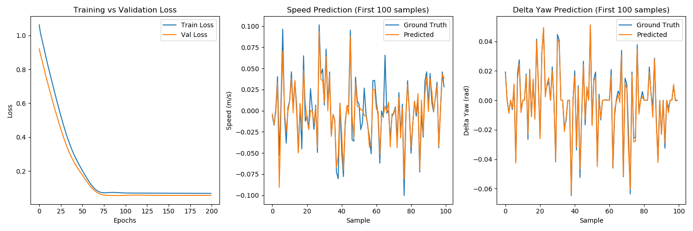

# SteerAI: Learning-Based MPC for Autonomous Racing

This project implements a learning-based Model Predictive Controller (MPC) for the POLARIS GEM e2 vehicle in a ROS Noetic simulation environment. It consists of three main stages: Data Collection, System Identification, and MPC Control.

## 1. Build and Run Instructions

### Prerequisites
- **ROS Noetic**
- **Python 3**
- **ROS Packages**:
  - `ackermann_msgs`
  - `geometry_msgs`
  - `nav_msgs`
  - `visualization_msgs`
  - `jsk_rviz_plugins`
  - `tf`
  - `dynamic_reconfigure`
  - `gem_gazebo` (Simulation environment)
- **Python Libraries**:
  - `torch` (PyTorch)
  - `casadi` (Optimization)
  - `pandas` (Data manipulation)
  - `numpy` (Numerical operations)
  - `scikit-learn` (Preprocessing)
  - `matplotlib` (Plotting)
  - `scipy` (Interpolation/KDTree)
  - `joblib` (Model persistence)
  - `rospkg` (ROS package path handling)

### Build
Clone the repository into your catkin workspace and build:
```bash
cd ~/catkin_ws/src
# Clone this repository
cd ~/catkin_ws
catkin_make
source devel/setup.bash
```

### Run the Simulation
1. **Launch the Gazebo Simulation:**
   ```bash
   roslaunch gem_gazebo gem_gazebo_rviz.launch
   ```

2. **Run the MPC Controller:**
   ```bash
   rosrun steerai_mpc mpc_controller.py
   ```
   *Note: Ensure you have a trained model before running the controller.*

---

## 2. System Identification

We use a data-driven approach to model the vehicle's dynamics, specifically capturing the complex relationship between control inputs and the vehicle's state updates.

### Method
1. **Data Collection**: The `steerai_data_collector` package drives the vehicle using a persistent excitation strategy (sinusoidal steering and varying velocities) to cover the state space.
2. **Model Architecture**: A Feed-Forward Neural Network (MLP) is trained using PyTorch.
   - **Inputs**: `[current_speed, cmd_speed, cmd_steering_angle]`
   - **Outputs**: `[next_speed, delta_yaw]` (Change in yaw)
   - **Structure**: Input Layer (3) -> Hidden Layer (64, ReLU) -> Hidden Layer (64, ReLU) -> Output Layer (2)

### Validation & Accuracy
The model is validated on a hold-out test set (20% of collected data).

- **Metric**: Root Mean Squared Error (RMSE)
- **Typical Performance**:
  - Speed RMSE: ~0.02 m/s
  - Delta Yaw RMSE: ~0.001 rad

**Training Results:**
The training script generates plots showing the loss curve and prediction performance against ground truth.
*(See `steerai_sysid/training_results.png` after training)*



To retrain the model:
```bash
rosrun steerai_sysid train_dynamics.py
```

---

## 3. MPC Controller Implementation

The `steerai_mpc` package implements a nonlinear MPC using **CasADi**.

### Hybrid Dynamics Model
To ensure stability at low speeds and accuracy at high speeds, the controller uses a **Hybrid Model**:
- **Low Speed (< 0.5 m/s)**: Uses a Kinematic Bicycle Model.
- **High Speed (> 2.0 m/s)**: Uses the learned Neural Network Model.
- **Transition**: A smooth linear blending (`alpha`) is applied between the two models based on current velocity.

### Optimization Problem
The MPC solves the following optimization problem at 10 Hz with a prediction horizon of **20 steps** (2.0 seconds):

**Cost Function:**
Minimize $J = \sum_{k=0}^{T} (w_{pos} \cdot e_{pos}^2 + w_{head} \cdot e_{head}^2 + w_{vel} \cdot e_{vel}^2 + w_{steer} \cdot \Delta \delta^2)$

- **Cross-Track Error ($e_{pos}$)**: Deviation from the reference path.
- **Heading Error ($e_{head}$)**: Deviation from the path's tangent.
- **Speed Error ($e_{vel}$)**: Deviation from the target reference speed.
- **Control Effort**: Penalties on rapid changes in steering and acceleration for smoothness.

**Constraints:**
- **Actuator Limits**:
  - Speed: $[-5.5, 5.5]$ m/s
  - Steering Angle: $[-0.6, 0.6]$ rad
- **Dynamics**: The vehicle state must evolve according to the Hybrid Dynamics Model.

### Path Following
The controller receives a global path (waypoints) and uses a **KDTree** for efficient nearest-neighbor search to find the local reference trajectory at each time step.

---

## 4. Docker Support

You can run the entire simulation and control stack using Docker.

### Build the Image
Navigate to the project directory:
```bash
cd ~/catkin_ws/src/POLARIS_GEM_e2
```

Build the Docker image:
```bash
docker build -t steerai .
```

### Run the Container
To run with GUI support (Gazebo/RViz):

```bash
xhost +local:root # Allow docker to access X server
docker run -it --rm \
    --net=host \
    --gpus all \
    --privileged \
    --env="DISPLAY" \
    --env="QT_X11_NO_MITSHM=1" \
    --volume="/tmp/.X11-unix:/tmp/.X11-unix:rw" \
    steerai
```

### Troubleshooting (No NVIDIA GPU)
If you encounter an error like `could not select device driver`, try running without GPU acceleration (performance may be slower):

```bash
xhost +local:root
docker run -it --rm \
    --net=host \
    --privileged \
    --env="DISPLAY" \
    --env="QT_X11_NO_MITSHM=1" \
    --volume="/tmp/.X11-unix:/tmp/.X11-unix:rw" \
    steerai
```

Inside the container, you can run the standard launch commands:
```bash
roslaunch gem_gazebo gem_gazebo_rviz.launch
rosrun steerai_mpc mpc_controller.py
```